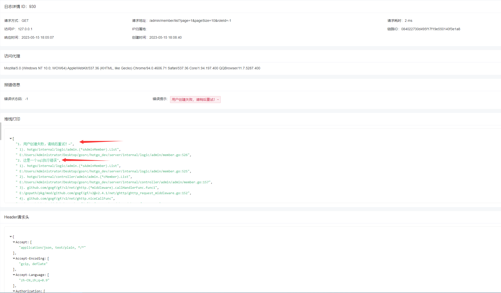

## 中间件/拦截器

目录

- 介绍
- 全局中间件
- 鉴权中间件
- 响应中间件
- 更多

### 介绍
- 在hotgo中，中间件/拦截器主要作用于web请求的上下文预设、跨域请求处理、鉴权处理、请求拦截和请求结束后统一响应处理等。


### 全局中间件
```go
package main

import (
	"hotgo/internal/service"
)

func main()  {
	
	// 初始化请求上下文，一般需要第一个进行加载，后续中间件存在依赖关系
	service.Middleware().Ctx() 
	
	// 跨域中间件，自动处理跨域问题
	service.Middleware().CORS()
	
	// IP黑名单中间件，如果请求IP被后台拉黑，所有请求将被拒绝
	service.Middleware().Blacklist()
	
	// 演示系統操作限制，当开启演示模式时，所有POST请求将被拒绝
	service.Middleware().DemoLimit()
	
	// HTTP响应预处理，在业务处理完成后，对响应结果进行格式化和错误过滤，将处理后的数据发送给请求方
	service.Middleware().ResponseHandler()
	
}

```
### 鉴权中间件
```go
package main

import (
	"github.com/gogf/gf/v2/frame/g"
)

func main()  {
	
	// 在鉴权中间件下的路由如果没有通过权限验证，后续请求将被拒绝
	// 在hotgo中，鉴权中间件一般是配合一个业务模块下的路由组进行使用
	// 目前admin、api、home、websocket模块都已接入
	// 如果你需要创建一个新的模块也需要用到鉴权中间件，可以参考：server/internal/logic/middleware/admin_auth.go
	
	
	// 一个简单例子
	s := g.Server()
	s.Group("/api", func(group *ghttp.RouterGroup) {
		group.Middleware(service.Middleware().ApiAuth)
		group.Bind(
			member.Member, // 管理员
		)
	})
	
}

```

### 响应中间件
- 文件路径：server/internal/logic/middleware/response.go


#### 常用响应类型

- hotgo为一些常用的响应类型做了统一格式封装，例如：`application/json`、`text/xml`、`text/html`、`text/event-stream`等，默认使用`application/json`。
- 下面我们以`text/xml`为例简单演示几种使用方法：

1. 当你使用规范化路由时，可直接在XxxRes结构体的`g.Meta`中声明响应类型：
```go
type HelloReq struct {
    g.Meta `path:"/hello" tags:"Hello" method:"get" summary:"You first hello api"`
    Name   string `json:"name" d:"hotgo" dc:"名字"`
}

type HelloRes struct {
    g.Meta `mime:"text/xml" type:"string"`
    Tips string `json:"tips"`
}
```

2. 在响应前设置响应头：
```go
var (
    Hello = cHello{}
)

type cHello struct{}

func (c *cHello) Hello(ctx context.Context, req *user.HelloReq) (res *user.HelloRes, err error) {
    r := ghttp.RequestFromCtx(ctx)
    r.Response.Header().Set("Content-Type", "text/xml")
	
    res = &user.HelloRes{
        Tips: fmt.Sprintf("hello %v, this is the api for %v applications.", req.Name, simple.AppName(ctx)),
    }
    return
}
```

- 浏览器中访问响应内容如下：
  


#### 自定义响应
- 在实际开发中，可能需要使用自定义的响应类型，由于响应中间件是全局的，因此您需要对其进行单独处理。
- 推荐以下几种处理方案，可做参考：
1. 使用`ghttp.ExitAll()`，需要注意的是此方法会终止后续所有的http处理

```go
package main

import (
	"github.com/gogf/gf/v2/net/ghttp"
)

func main()  {
	r := new(ghttp.Request) // 当前请求对象

	// 清空响应
	r.Response.ClearBuffer()

	// 写入响应
	r.Response.Write("自定义响应内容")
	
	// 终止后续http处理
	r.ExitAll()
}
```

2. 在`server/internal/logic/middleware/response.go`中根据请求的独有特征进行单独的处理，兼容后续http处理。


#### 重写响应错误提示

- 在实际开发中，我们可能想要隐藏一些敏感错误，返回给客户端友好的错误提示，但开发者同时又想需要看到真实的敏感错误。对此hotgo已经进行了过滤处理，下面是一个简单的例子：

```go
package main

import (
	"github.com/gogf/gf/v2/errors/gerror"
)

func test() error {
	err = gerror.New("这是一个sql执行错误")
	err = gerror.Wrap(err, "用户创建失败，请稍后重试！~")
	return err
}
```

- 开启debug时的客户端响应：
```json
{
  "code": -1,
  "message": "用户创建失败，请稍后重试！~",
  "error": [
    "1. 用户创建失败，请稍后重试！~",
    "   1).  hotgo/internal/logic/admin.(*sAdminMember).List",
    "        E:/Users/Administrator/Desktop/gosrc/hotgo_dev/server/internal/logic/admin/member.go:526",
    "2. 这是一个sql执行错误", "   1).  hotgo/internal/logic/admin.(*sAdminMember).List",
    "        E:/Users/Administrator/Desktop/gosrc/hotgo_dev/server/internal/logic/admin/member.go:525",
    "   2).  hotgo/internal/controller/admin/admin.(*cMember).List",
    "        E:/Users/Administrator/Desktop/gosrc/hotgo_dev/server/internal/controller/admin/admin/member.go:157", ""
  ],
  "timestamp": 1684145107,
  "traceID": "084022730d495f17f19e550140f3e1a8"
}
```

- 关闭debug时的客户端响应：
```json
{
  "code": -1,
  "message": "用户创建失败，请稍后重试！~",
  "timestamp": 1684145107,
  "traceID": "084022730d495f17f19e550140f3e1a8"
}
```

- 控制台的输出日志：
```shell
2023-05-15 18:05:07.776 {084022730d495f17f19e550140f3e1a8} 200 "GET http localhost:8000 /admin/member/list?page=1&pageSize=10&roleId=-1 HTTP/1.1" 0.002, 127.0.0.1, "http://192.168.0.207:8001/login", "Mozilla/5.0 (Windows NT 10.0; WOW64) AppleWebKit/537.36 (KHTML, like Gecko) Chrome/94.0.4606.71 Safari/537.36 Co
re/1.94.197.400 QQBrowser/11.7.5287.400", -1, "", ""
Stack:
1. 用户创建失败，请稍后重试！~
   1).  hotgo/internal/logic/admin.(*sAdminMember).List
        E:/Users/Administrator/Desktop/gosrc/hotgo_dev/server/internal/logic/admin/member.go:526
2. 这是一个sql执行错误
   1).  hotgo/internal/logic/admin.(*sAdminMember).List
        E:/Users/Administrator/Desktop/gosrc/hotgo_dev/server/internal/logic/middleware/response.go:24
   13). hotgo/internal/logic/middleware.(*sMiddleware).DemoLimit
        E:/Users/Administrator/Desktop/gosrc/hotgo_dev/server/internal/logic/middleware/init.go:90

```

- 如果你开启了访问日志，那么日志记录中会详细记录本次请求的相关信息，内容如下：



#### 重写错误码
- hotgo默认使用了gf内置的错误码进行业务处理，通常情况下成功状态码为`0`，失败状态码为`-1`
- 查看gf内置错误码：https://goframe.org/pages/viewpage.action?pageId=30739587
- 以下是自定义错误码的简单例子：

```go
package main

import (
	"github.com/gogf/gf/v2/errors/gerror"
)

func test() error {
	// 使用自定义状态码30001响应客户端
	err = gerror.NewCode(gcode.New(30001, "用户创建失败，请稍后重试！~", nil))
	return err
}
```


- 客户端响应如下：
```json
{
	"code": 30001,
	"message": "用户创建失败，请稍后重试！~",
	"timestamp": 1684146313,
	"traceID": "b4f90e16264a5f17cd3fc27141aba448"
}
```

### 更多
- 更多关于中间件/拦截器的介绍请参考：https://goframe.org/pages/viewpage.action?pageId=55289881

